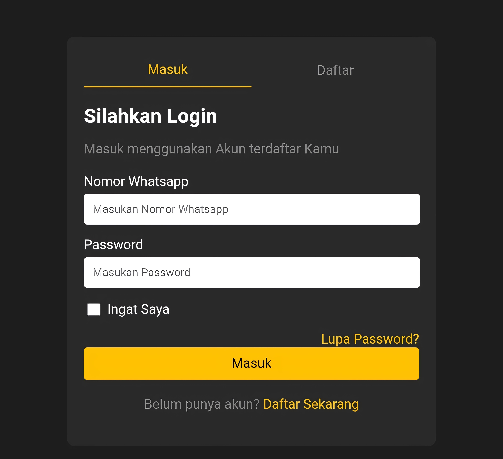
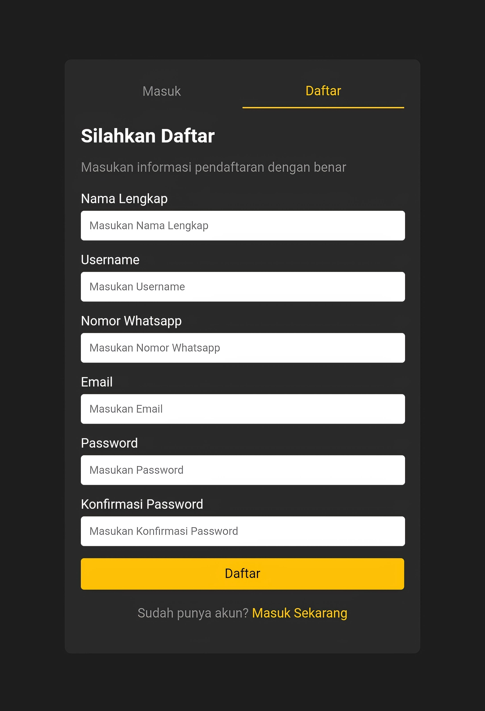

# Login dan Register API

Proyek ini adalah implementasi server sederhana menggunakan **Node.js** dan **Express.js** yang menyediakan fitur **Login** dan **Register** untuk pengguna. API ini menggunakan request berbasis JSON untuk mengelola data pengguna.

---

## **Fitur**

1. **Register**
   - Endpoint: `/api/register`
   - Metode: `POST`
   - Deskripsi: Mendaftarkan pengguna baru ke sistem.
   - Input (Body JSON):
     ```json
     {
       "fullName": "Nama Lengkap",
       "username": "nama_pengguna",
       "whatsapp": "081234567890",
       "email": "email@example.com",
       "password": "password123"
     }
     ```
   - Respon Sukses:
     ```json
     {
       "message": "Pendaftaran berhasil"
     }
     ```
   - Respon Gagal:
     ```json
     {
       "message": "Nomor WhatsApp atau email sudah terdaftar"
     }
     ```

2. **Login**
   - Endpoint: `/api/login`
   - Metode: `POST`
   - Deskripsi: Memverifikasi data login pengguna.
   - Input (Body JSON):
     ```json
     {
       "whatsapp": "081234567890",
       "password": "password123"
     }
     ```
   - Respon Sukses:
     ```json
     {
       "message": "Login berhasil"
     }
     ```
   - Respon Gagal:
     ```json
     {
       "message": "Nomor WhatsApp atau password salah"
     }
     ```

---

## **Persyaratan Sistem**

- **Node.js** versi 14 atau lebih baru.
- **NPM** (Node Package Manager).

---

## **Cara Menjalankan Proyek**

Ikuti langkah-langkah berikut untuk menjalankan proyek ini di lokal:

1. Clone repository:
   ```bash
   git clone https://github.com/reytanokodriansyah/login-and-register.git
   cd login-and-register
   ```

2. Instalasi dependensi:
   ```bash
   npm install
   ```

3. Jalankan server:
   ```bash
   node server.js
   ```

4. Server akan berjalan di `http://localhost:3000`.

---

## **Penggunaan API**

Gunakan aplikasi seperti **Postman** atau **curl** untuk menguji endpoint API.

### **Contoh Request dengan curl**

- **Register**:
   ```bash
   curl -X POST http://localhost:3000/api/register \
   -H "Content-Type: application/json" \
   -d '{
     "fullName": "John Doe",
     "username": "johndoe",
     "whatsapp": "081234567890",
     "email": "johndoe@example.com",
     "password": "password123"
   }'
   ```

- **Login**:
   ```bash
   curl -X POST http://localhost:3000/api/login \
   -H "Content-Type: application/json" \
   -d '{
     "whatsapp": "081234567890",
     "password": "password123"
   }'
   ```

---

## **Catatan**

- Data pengguna disimpan sementara di memori server (array JavaScript). **Jangan gunakan untuk produksi!** Gunakan database seperti MySQL, MongoDB, atau PostgreSQL untuk penyimpanan yang lebih aman.
- Pastikan mengonfigurasi server untuk deployment jika digunakan dalam lingkungan nyata.

# Hasil (img)

### Login


---

### Register

